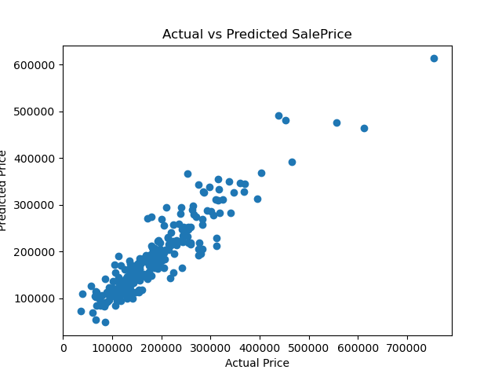
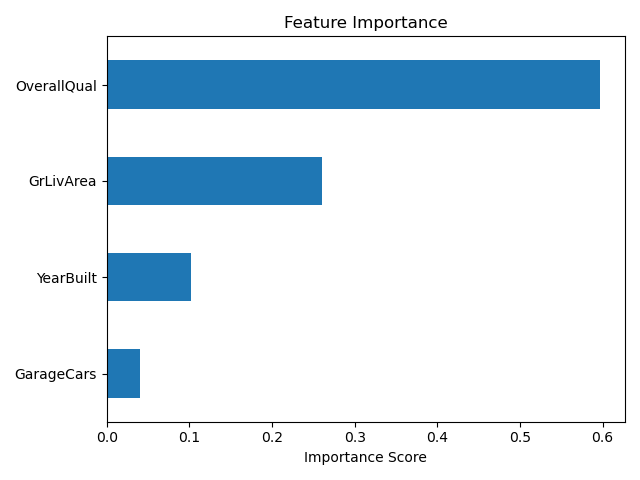

# House Price Prediction Using Random Forest

## Introduction

In this project, I aim to predict house sale prices using data from the Kaggle competition [House Prices: Advanced Regression Techniques](https://www.kaggle.com/competitions/house-prices-advanced-regression-techniques). Accurately predicting housing prices is a valuable task in real estate, mortgage lending, and urban planning. I use a Random Forest model to estimate prices based on a few core house attributes.

## Data Source and Preparation

Data was accessed through the Kaggle API and automatically downloaded using a custom Python function. The dataset includes 79 explanatory variables describing (almost) every aspect of residential homes in Ames, Iowa. For simplicity and model clarity, I selected four important features to begin with:

- `GrLivArea`: Above ground living area (in square feet)
- `OverallQual`: Overall material and finish quality
- `YearBuilt`: Year the house was built
- `GarageCars`: Number of cars the garage can hold

Missing values were handled by mean imputation, and the dataset was split into training (80%) and testing (20%) sets using `train_test_split`.

## Model and Evaluation

I trained a `RandomForestRegressor` with default hyperparameters. The model was evaluated using Root Mean Squared Error (RMSE) and R² Score.

### Results:

- **RMSE**: \$32,311.91  
- **R² Score**: 0.8639

These results indicate strong predictive performance, with the model explaining approximately 86% of the variance in house prices.

### Feature Importance:

The Random Forest model identified the following feature importances:

| Feature      | Importance |
|--------------|------------|
| OverallQual  | 59.7%      |
| GrLivArea    | 26.1%      |
| YearBuilt    | 10.2%      |
| GarageCars   | 4.0%       |

As expected, overall material quality and living area size were the most significant predictors of sale price.

## Discussion

While the model achieved strong predictive performance with an R² score of 0.8639, there are still several aspects worth reflecting upon. The current model uses only four features—`OverallQual`, `GrLivArea`, `YearBuilt`, and `GarageCars`—which are indeed among the most influential variables. However, house prices are influenced by many additional factors, such as neighborhood, basement quality, exterior condition, and kitchen finish, which are not yet included in this version. Incorporating these features could further enhance model accuracy.

In addition, the Random Forest model was trained using default hyperparameters. While it performs well, model tuning using cross-validation and parameter search (e.g., GridSearchCV) may lead to better generalization and reduced overfitting. Another consideration is that tree-based models like Random Forest, while powerful, are less interpretable than linear models. In contexts where explanation is critical—such as financial decision-making or policy recommendations—model transparency might be as important as accuracy.

Despite these limitations, the model provides valuable insights. The feature importance analysis confirms that housing quality and size are key drivers of price, aligning with real-world expectations. Overall, this version of the model strikes a balance between simplicity and performance, and serves as a solid foundation for future improvements.

## Conclusion

Using a Random Forest regressor with basic preprocessing, I was able to build a model with good predictive power on house prices. The workflow included API-based data fetching, cleaning, training, evaluation, and visualization. This project highlights the importance of feature selection and shows that even simple models can provide valuable insights.

[My Github Link](https://github.com/Tiff0416/house-price-prediction)