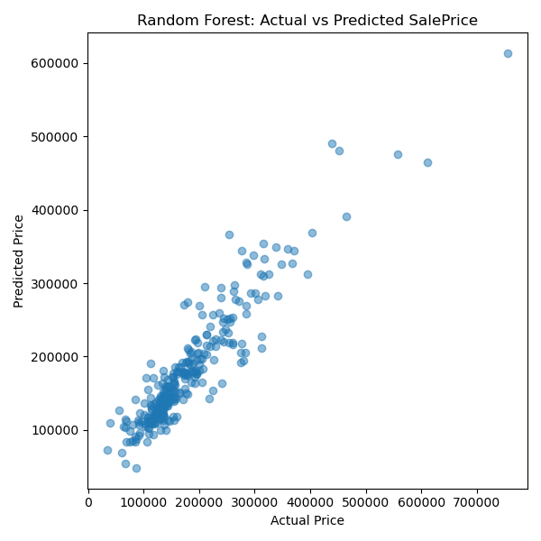
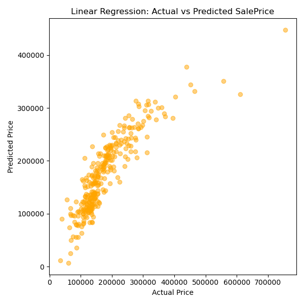
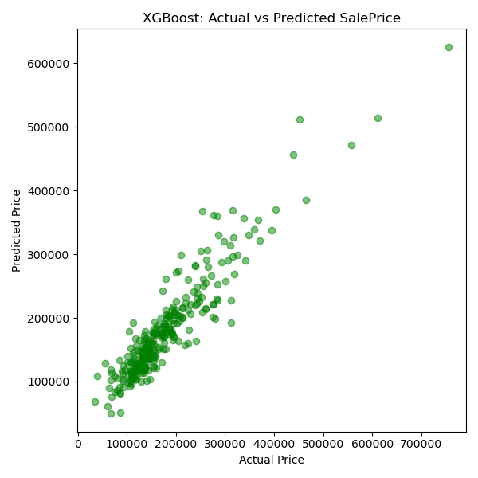
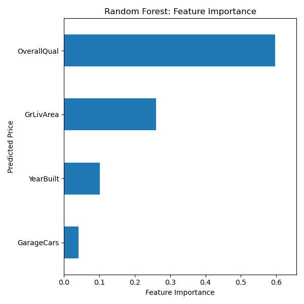

# House Price Prediction: Comparing Tree-Based Models with Linear Regression

## Introduction

In this project, I aim to predict house sale prices using data from the Kaggle competition [House Prices: Advanced Regression Techniques](https://www.kaggle.com/competitions/house-prices-advanced-regression-techniques). Accurately predicting housing prices is a valuable task in real estate, mortgage lending, and urban planning. I compare three modeling techniques—Linear Regression, Random Forest, and XGBoost—to evaluate their performance and suitability for this task.

## Data Source and Preparation

Data was accessed through the Kaggle API and automatically downloaded using a custom Python function (`data_utils.py`). The dataset includes 79 explanatory variables describing nearly every aspect of residential homes in Ames, Iowa. For simplicity and model clarity, I selected four core features:

- `GrLivArea`: Above ground living area (in square feet)  
- `OverallQual`: Overall material and finish quality  
- `YearBuilt`: Year the house was built  
- `GarageCars`: Number of cars the garage can hold  

Missing values were handled by mean imputation, and the dataset was split into training (80%) and testing (20%) sets using `train_test_split`.

## Model Training and Evaluation

Three models were trained and evaluated:

1. **Linear Regression**
2. **Random Forest**
3. **XGBoost**

All models were evaluated using Root Mean Squared Error (RMSE) and R² score on the testing set.

### Model Results:

| Model             | RMSE      | R² Score |
|-------------------|-----------|----------|
| Linear Regression | 42509.32  | 0.7644   |
| Random Forest     | 32311.91  | 0.8639   |
| XGBoost           | 32172.62  | 0.8651   |

### Feature Importance (Random Forest):

| Feature      | Importance |
|--------------|------------|
| OverallQual  | 59.7%      |
| GrLivArea    | 26.1%      |
| YearBuilt    | 10.2%      |
| GarageCars   | 4.0%       |

## Discussion

While all three models demonstrate a reasonable ability to predict house prices, their performance varies significantly. Linear Regression, despite being a straightforward and interpretable model, underperforms relative to ensemble tree-based methods, likely due to its inability to capture non-linear relationships. Random Forest significantly improves accuracy by aggregating multiple decision trees, and XGBoost provides a slight performance edge over Random Forest through gradient boosting and regularization techniques.

The Random Forest model's feature importance reveals that material quality (`OverallQual`) and living area size (`GrLivArea`) are the most influential variables—findings that align with intuition and real-world housing market dynamics. Although only four features were used in this version, additional predictors such as neighborhood, basement finish, and kitchen quality could further improve model performance.

It’s worth noting that all models were trained using default parameters. Future improvements could include hyperparameter tuning (e.g., via GridSearchCV or Optuna) and feature engineering. Additionally, cross-validation would offer a more robust estimate of model generalizability.

## Visualizations

- **Random Forest: Actual vs Predicted**  
  
  *Figure 1: Scatter plot comparing actual and predicted house prices using Random Forest. The closer the points are to the diagonal line, the better the prediction accuracy.*

- **Linear Regression: Actual vs Predicted**  
  
  *Figure 2: Linear Regression predictions show a reasonable trend but with more variance compared to tree-based models.*

- **XGBoost: Actual vs Predicted**  
  
  *Figure 3: XGBoost yields the best fit among the three, showing tight clustering along the ideal prediction line.*

- **Random Forest: Feature Importance**  
  
  *Figure 4: Feature importance plot showing which input variables contribute most to Random Forest predictions.*

## Conclusion

Among the three models tested, XGBoost produced the best overall performance in predicting house prices, closely followed by Random Forest. Linear Regression, while interpretable, showed lower accuracy. This comparison illustrates the benefits of tree-based ensemble methods for handling structured real estate data. The results also reinforce the importance of key housing features like overall quality and living area in determining market value.

[GitHub Repository](https://github.com/Tiff0416/house-price-prediction)
